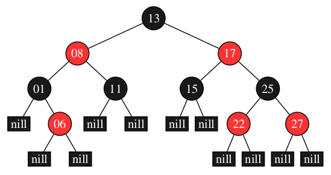
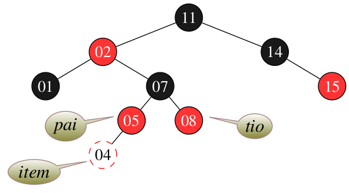
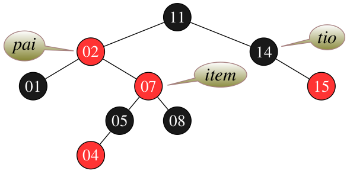
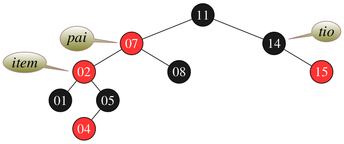
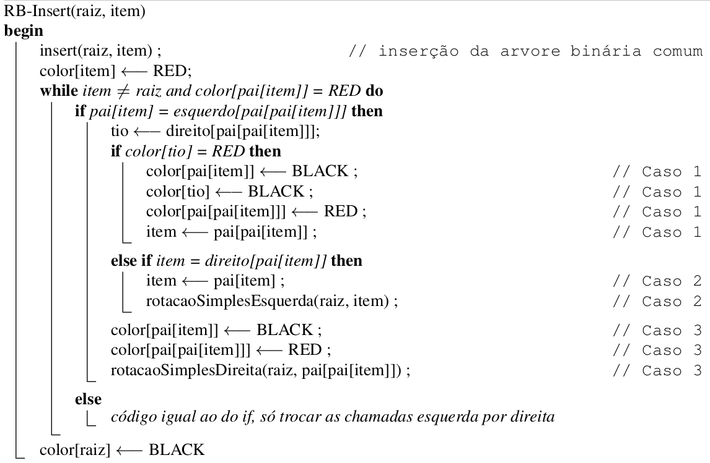

# Árvore Red Black

 
 
 
 

 

 

	Em uma árvore binária do tipo Red Black (RB), os nós se mantêm aprocimadamente balanciados por meio de uma estratégia de cores. Diferente da AVL, em uma RB os nós são avaliados considerando um processo de parentesco, em que vizinhos são considerados e esses devem obedecer certos critérios de cor para indicar que a estrutura se encontra balanceada. Isso permite que processos de inserção, remoção e pesquisa sejam realizados sob custo computacional de O(logn). Um exemplo da estrutura de uma RB pode ser observada na Fig 1.

   
  <caption>Fig 1. Exemplo de estrutura de uma árvore binária do tipo Red Black.</caption>

Considerando o exemplo da Fig. 1, a estrutura RB define uma série de regras para que a estrutura se mantenha balanceda, são elas: 

>
> 1. Todo nó é vermelho ou preto
> 2. A raiz é sempre preta, mesmo sendo o único nó
> 3. Todo nó folha define seus filhos em nulo e esses são considerados sendo pretos. 
> 4. Se um nó é vermelho, então ambos os vizinhos são pretos.
> 5. Para todo nó, todos os caminhos até as folhas apresentam o mesmo número de nós pretos. 
> 6. Para cada nova inserção, o novo nó começa com a cor vermelha.
>

	Para que a estrutura RB se mantenha em conformidade com as 6 diretrizes acima apresentadas, sua construção é realizada adotando-se 3 casos de análise para cada nova inserção e remoção. Além disso, diferente da AVL, essa estrutura se baseia apenas em rotações simples para corrigir a falta de balanceamento entre suas sub-árvores.

>
> **Caso 1**: A inserção de um novo nó vermelho deve 'GARANTIR' que seus vizinhos, i.e., nós próximos a um nível acima, considerados como pai e tio, devem ser pretos. 
>  

   
  <caption>Fig 2. Definição do caso 1 para uma estrutura em que a inserção do nó com valor 4 produz um desbalanceamento.</caption>

Considerando a Fig. 2, uma correção na estrutura deve ser realizada para deixá-la em conformidade com as regras apresentadas. Nesse contexto, considerando o caso 1, a solução é deixar o pai e tio pretos e avançar os ponteiros da estrutura sentido raiz, o que induzirá uma avaliação do caso 2. A Fig. 3 detalha o processo realizado no caso 1 que leva a estrutura para a análise do caso 2. 

>
> **Caso 2**: O tio de um nó (i.e., item) é preto, o item e seu pai são vermelhos e o item é o filho da direita.
> 

   
  <caption>Fig 3. Correção da estrutura considerando o problema abordado no caso 1.</caption>

Uma vez feita a correção do caso 1, os ponteiros de análise são atualizados para um nível acima conforme detalhando na Fig 3, o que nos leva ao caso 2. Neste caso há necessidade de executar uma correção por rotação. Essa é realizada a partir do pai e é realizada para a esquerda conforme exemplo da Fig 4. 

   
  <caption>Fig 4. Correção da estrutura considerando o problema abordado no caso 2.</caption>

	Uma vez realizada a rotação, note que os ponteiros de pai e item são atualizados, bem como, a organização de filhos se compararmos com a estrutura da Fig 3 que detalha a RB antes da rotação. 

	Ao realizar a rotação programada pelo caso 2, chega-se a última etapa de análise e correção, o caso 3. 

>
> **Caso 3**: O tio do item é preto, o item e seu pai são vermelhos e o item é o filho da esquerda. 
> 

Como forma de atendimento ao caso 3, o pai do pai deve ser aplicado a uma troca de cor (e.g., nesse caso o nó com valor 11 passa a ser vermelho) e a árvore rotacionada para a direita. A Fig 5 detalha esse processo e a árvore resultante após a finalização da análise e rotações.

   
  <caption>Fig 5. Correção da estrutura considerando o problema abordado no caso 3.</caption>

 Após a finalização do caso 3, a estrutura volta a se encontrar balanceada. Para termos certeza basta identificar o número de nós pretos desde a raiz até as folhas, esses devem se apresentar em mesmo número para todos os caminhos. Se isso for verdade, a estrutura se encontrará correta. Por fim, a Fig 6 detalha um pseudo algoritmo que une os três casos segundo Cormen at. all. 

   
  <caption>Fig 6. Pseudo algoritmo de balanceamento adotado pela árvore Red Black segundo Cormen at all.</caption>

	Segundo Cormen at. all, após a aplicação das estratégias acima abordadas para o balanceamento, a altura _ h _ de uma árvore RB com _ n _ chaves é de no máximo 2log(n+1). A prova é por indução e pode ser observada em detalhes no capítulo 13 do livro Algoritmos: Teoria e Prática. Por fim, como vantagem em comparação com a AVL, a RB emprega apenas rotações simples e não adota recursão para avaliar seus casos, o que pode beneficiar sua utilização para estruturas muito profundas.  

# Compilação e Execução

A estrutura árvore disponibilizada possui um arquivo Makefile que realiza todo o procedimento de compilação e execução. Para tanto, temos as seguintes diretrizes de execução:

| Comando                |  Função                                                                                           |                     
| -----------------------| ------------------------------------------------------------------------------------------------- |
|  `make clean`          | Apaga a última compilação realizada contida na pasta build                                        |
|  `make`                | Executa a compilação do programa utilizando o gcc, e o resultado vai para a pasta build           |
|  `make run`            | Executa o programa da pasta build após a realização da compilação                                 |

# Contatos

 

<a style="color:black" href="mailto:michel@cefetmg.br?subject=[GitHub]%20Source%20Dynamic%20Lists">
✉️ <i>michel@cefetmg.br</i>
</a>

